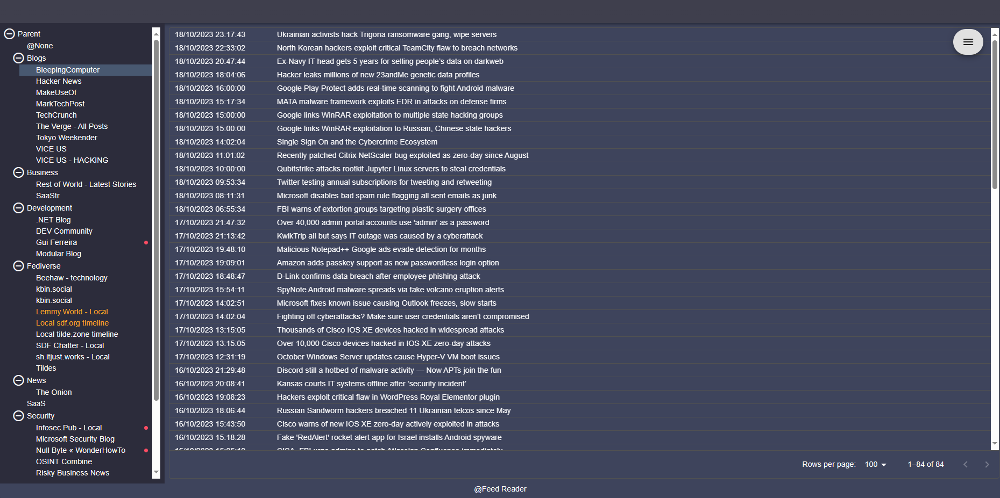
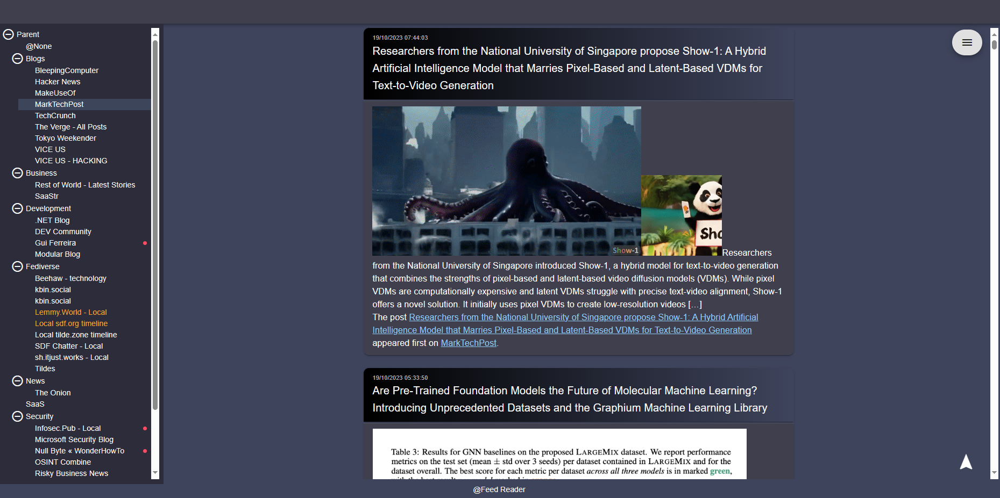
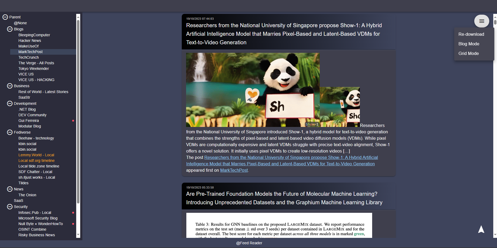
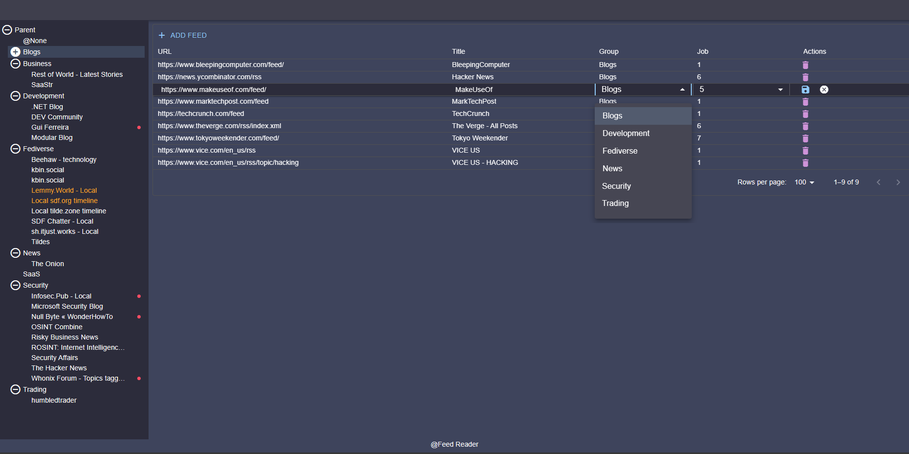

# Feed Reader

Rss reader with data source coming from Supabase PostgreSQL tables.  
Rss contents are downloaded periodically by using Supabase cron job 

Technology stack:
- Supabase
  * js client
  * edge functions
  * PostgeSQL cron scheduler
- React.js (Vite + TypeScript)
- TanStack React Query
- Sass
- Material UI

Feature:
1. Tree Navigation
2. View items in list mode
   

3. View items in blog mode   
   In order to switch between these 2 modes, use shortcut CTRL + SHIFT + Z, or select the mode manually from action menu on the right side of the screen
   

4. Feed menu
     * Redownload RSS items from db
     * change view mode 
   

5. Group list
   Selecting group node will display all Rss feed under the group.
     * Click ADD FEED to add new url
     * Double click on the row to edit
     * Click on delete icon to delete the url and its content
   
